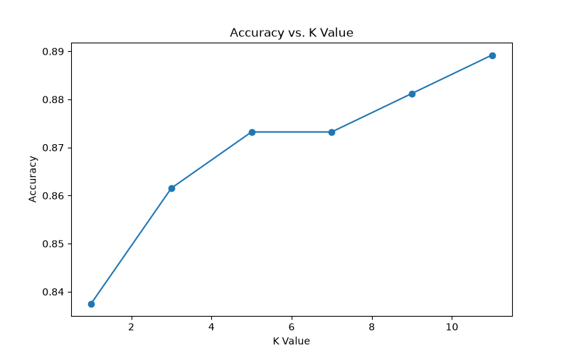
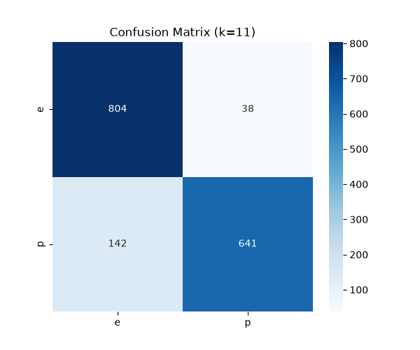
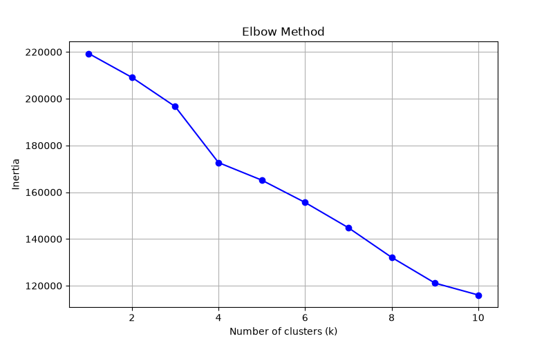
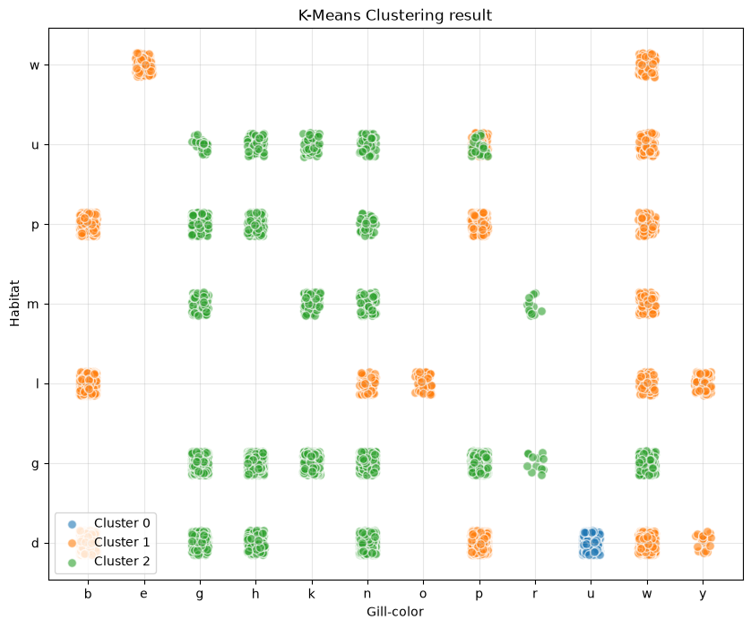

# Machine Learning Project: Mushroom Classification and Clustering

## ภาพรวมโปรเจกต์ (Project Overview)
โปรเจกต์นี้เป็นการประยุกต์ใช้อัลกอริทึม Machine Learning สองรูปแบบ ได้แก่ การจำแนกประเภทแบบมีผู้สอน (Supervised Learning) และการจัดกลุ่มแบบไม่มีผู้สอน (Unsupervised Learning) กับชุดข้อมูลลักษณะทางกายภาพของเห็ด (Mushroom Dataset) กระบวนการทำงานครอบคลุมตั้งแต่การจัดการข้อมูลประเภทหมวดหมู่ (Categorical Data), การเลือกคุณลักษณะ (Feature Selection), การสร้างแบบจำลอง K-Nearest Neighbors (KNN) และ K-Means Clustering ไปจนถึงการประเมินประสิทธิภาพและสร้างกราฟแสดงผล

## วัตถุประสงค์ (Objectives)
* จัดเตรียมข้อมูลและแปลงข้อมูลประเภทข้อความให้เป็นตัวเลขด้วยเทคนิค Dummy Encoding
* สร้างโมเดล K-Nearest Neighbors (KNN) เพื่อจำแนกประเภทเห็ด (มีพิษ หรือ ทานได้)
* สร้างโมเดล K-Means Clustering เพื่อจัดกลุ่มเห็ดตามลักษณะทางกายภาพโดยไม่ใช้คอลัมน์เฉลยเป้าหมาย
* ค้นหาค่า K ที่เหมาะสมที่สุดสำหรับทั้งสองโมเดล (ผ่าน Validation Accuracy และ Elbow Method)
* ประเมินประสิทธิภาพของโมเดลและแสดงผลข้อมูล (Data Visualization) ในรูปแบบกราฟ 2 มิติ

## ชุดข้อมูล (Dataset)
* **ชื่อชุดข้อมูล:** Mushroom Dataset (mushrooms.csv)
* **คำอธิบาย:** ชุดข้อมูลตาราง (Tabular Data) เก็บบันทึกลักษณะทางกายภาพของเห็ด ประกอบด้วยคุณลักษณะต่างๆ ที่เป็นข้อความ (Categorical) เช่น สีของครีบ (gill-color), สีของเยื่อหุ้ม (veil-color), ลักษณะผิวหมวก (cap-surface) และแหล่งที่อยู่อาศัย (habitat) รวมไปถึงคลาสเป้าหมายที่ระบุว่าเห็ดมีพิษหรือทานได้

## โครงสร้างโปรเจกต์ (Project Structure)
```text
LAB04/
├── classification/
│   ├── outputs/
│   │   ├── 01_k_curve.png
│   │   ├── 02_confusion_matrix.png
│   │   └── predictions.csv
│   ├── data_loader.py
│   ├── evaluate.py
│   ├── knn_tf.py
│   └── main.py
├── clustering/
│   ├── outputs/
│   │   ├── 01_elbow.png
│   │   ├── 02_clusters.png
│   │   ├── cluster_summary.csv
│   │   └── clustered_mushrooms.csv
│   ├── data_loader.py
│   ├── kmeans_tf.py
│   ├── knn_tools.py
│   ├── main.py
│   └── visualize.py
├── data-mushroom/
│   └── mushrooms.csv
├── README.md
├── link-data.txt
└── requirements.txt
```

## ขั้นตอนการทำงาน (Project Workflow)
1. **Load Dataset:** โหลดข้อมูลจากไฟล์ CSV
2. **Data Preprocessing:** เลือกใช้งานคุณลักษณะที่เหมาะสม และแปลงข้อมูลหมวดหมู่เป็นตัวเลขด้วย Dummy Encoding
3. **Classification (KNN):** ฝึกสอนและทดสอบโมเดลจำแนกประเภทเห็ด พร้อมประเมินผลผ่าน Validation Accuracy
4. **Clustering (K-Means):** ตัดคอลัมน์คำตอบทิ้งและให้คอมพิวเตอร์จัดกลุ่มข้อมูลเอง พร้อมคำนวณค่า Inertia เพื่อหาจุดหักศอก
5. **Model Evaluation & Visualization:** วัดผลความแม่นยำและวาดกราฟแสดงผลการแบ่งกลุ่ม

## การแสดงผลข้อมูล (Data Visualization)
โปรเจกต์นี้รวมการสร้างกราฟและไฟล์ผลลัพธ์ดังนี้:

<div align="center">
  
  <p><b>รูปที่ 1: K-Curve (Classification)</b></p>
</div>

<div align="center">
  
  <p><b>รูปที่ 2: Confusion Matrix (Classification)</b></p>
</div>

<div align="center">
  
  <p><b>รูปที่ 3: Elbow Method (Clustering)</b></p>
</div>

<div align="center">
  
  <p><b>รูปที่ 4: Cluster Visualization (Clustering)</b></p>
</div>

## ภาษาโปรแกรมและไลบรารี (Programming Language & Libraries)
* **ภาษาโปรแกรม:** Python 3
* **ไลบรารี:** pandas, numpy, matplotlib, scikit-learn, pathlib

## ผลลัพธ์ที่ได้ (Output)
เมื่อรันโปรแกรมสำเร็จ ระบบจะสร้างไฟล์ผลลัพธ์และกราฟเก็บไว้ในโฟลเดอร์ `outputs` ของแต่ละโมเดลโดยอัตโนมัติ

## เอกสารอ้างอิง (References)
* **Dataset:** UCI Machine Learning Repository. Mushroom Dataset:Kaggle https://www.kaggle.com/datasets/uciml/mushroom-classification
