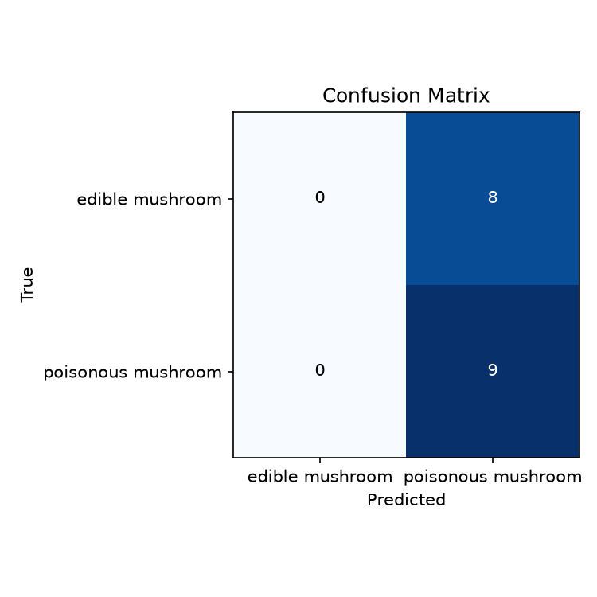
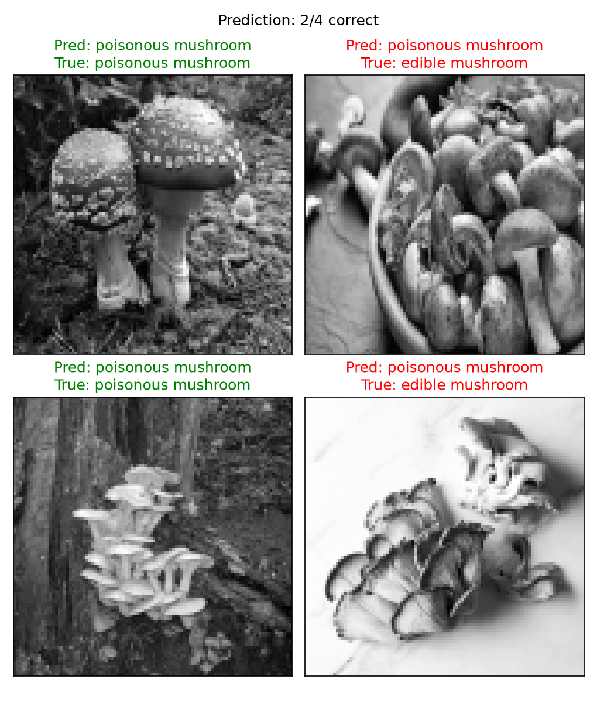

# Machine Learning Project: Edible and Poisonous Mushroom Image Classification (SVM)

## ภาพรวมโปรเจกต์ (Project Overview)
โปรเจกต์นี้เป็นการประยุกต์ใช้เทคนิค Machine Learning และ Computer Vision ในการจำแนกประเภทของเห็ดว่า "มีพิษ" (Poisonous) หรือ "สามารถรับประทานได้" (Edible) จากข้อมูลภาพถ่าย (Image Dataset) โดยเปลี่ยนจากการใช้โมเดล Deep Learning มาเป็นการสกัดคุณลักษณะของภาพ (Feature Extraction) และใช้แบบจำลอง Support Vector Machine (SVM) ในการจำแนกคลาส กระบวนการครอบคลุมตั้งแต่การโหลดภาพ แปลงเป็นอาร์เรย์ตัวเลข การทำ Data Scaling ไปจนถึงการประเมินผลประสิทธิภาพและแสดงกราฟ

## วัตถุประสงค์ (Objectives)
* จัดเตรียมและประมวลผลข้อมูลรูปภาพเห็ดให้อยู่ในรูปแบบอาร์เรย์ (Numpy arrays) เพื่อใช้ฝึกสอนโมเดล
* ทำการสเกลข้อมูล (Data Scaling) และบันทึกพารามิเตอร์ผ่าน `scaler.pkl` เพื่อให้ข้อมูลมีมาตรฐานเดียวกัน
* สร้างและฝึกสอนโมเดล Support Vector Machine (SVM) สำหรับคัดแยกประเภทเห็ด
* ประเมินประสิทธิภาพของโมเดล (รวมถึงวิเคราะห์ปัญหา Model Bias) ผ่าน Confusion Matrix และตัวอย่างภาพทำนาย

## ชุดข้อมูล (Dataset)
* **ชื่อชุดข้อมูล:** Edible and Poisonous Mushroom Images
* **คำอธิบาย:** ชุดข้อมูลรูปภาพ (Image Data) ที่รวบรวมภาพถ่ายของเห็ด โดยถูกแบ่งเก็บในโฟลเดอร์ตามคลาส 2 หมวดหมู่ ได้แก่ `edible mushroom/` (เห็ดที่รับประทานได้) และ `poisonous mushroom/` (เห็ดมีพิษ)
* **ที่มา (Source):** Kaggle https://www.kaggle.com/datasets/mdismielhossenabir/edible-and-poisonous-mushroom-images

## โครงสร้างโปรเจกต์ (Project Structure)
```text
LAB04/
├── MushroomImages/
│   ├── edible mushroom/
│   └── poisonous mushroom/
├── classification/
│   ├── outputs/
│   │   ├── X_test.npy
│   │   ├── X_train.npy
│   │   ├── classes.json
│   │   ├── confusion_matrix.png
│   │   ├── images.npy
│   │   ├── labels.npy
│   │   ├── prediction_sample.png
│   │   ├── scaler.pkl
│   │   ├── svm_model.pkl
│   │   ├── y_test.npy
│   │   └── y_train.npy
│   ├── data_loader.py
│   ├── evaluate.py
│   ├── main.py
│   └── preprocessing.py
├── README.md
├── link-data.txt.txt
└── requirements.txt
```

## ขั้นตอนการทำงาน (Project Workflow)
1. **Data Loading:** โหลดรูปภาพจากชุดข้อมูล แปลงเป็นอาร์เรย์ บันทึกเป็น `images.npy` และ `labels.npy` (`data_loader.py`)
2. **Preprocessing & Splitting:** แบ่งข้อมูลเป็นชุด Train/Test และทำ Standard Scaling พร้อมบันทึก `scaler.pkl` (`preprocessing.py`)
3. **Model Training (SVM):** ฝึกสอนโมเดลด้วยอัลกอริทึม SVM และบันทึกโมเดลที่สมบูรณ์เป็น `svm_model.pkl` (`main.py`)
4. **Model Evaluation & Visualization:** ประเมินความแม่นยำของโมเดล วาดกราฟ Confusion Matrix และสุ่มภาพเพื่อแสดงผลการทำนาย (`evaluate.py`)

## การแสดงผลข้อมูล (Data Visualization)
โปรเจกต์นี้รวมการสร้างกราฟและไฟล์ผลลัพธ์ดังนี้ *(หมายเหตุ: จากผลการประเมินพบว่าโมเดลมีแนวโน้มเอนเอียง (Bias) ไปที่การทำนายคลาส poisonous mushroom เพียงอย่างเดียว)*:

<div align="center">
  
  <p><b>รูปที่ 1: Confusion Matrix (SVM)</b></p>
</div>

<div align="center">
  
  <p><b>รูปที่ 2: Prediction Sample (SVM)</b></p>
</div>

## ภาษาโปรแกรมและไลบรารี (Programming Language & Libraries)
* **ภาษาโปรแกรม:** Python 3
* **ไลบรารี:** scikit-learn, numpy, opencv-python (หรือ PIL), matplotlib

## ผลลัพธ์ที่ได้ (Output)
เมื่อรันโปรแกรมสำเร็จ ระบบจะสร้างไฟล์ผลลัพธ์ อาร์เรย์ข้อมูล โมเดล และกราฟเก็บไว้ในโฟลเดอร์ `classification/outputs/` โดยอัตโนมัติ

## เอกสารอ้างอิง (References)
* **Dataset:** Edible and Poisonous Mushroom Images Dataset: Kaggle https://www.kaggle.com/datasets/mdismielhossenabir/edible-and-poisonous-mushroom-images
